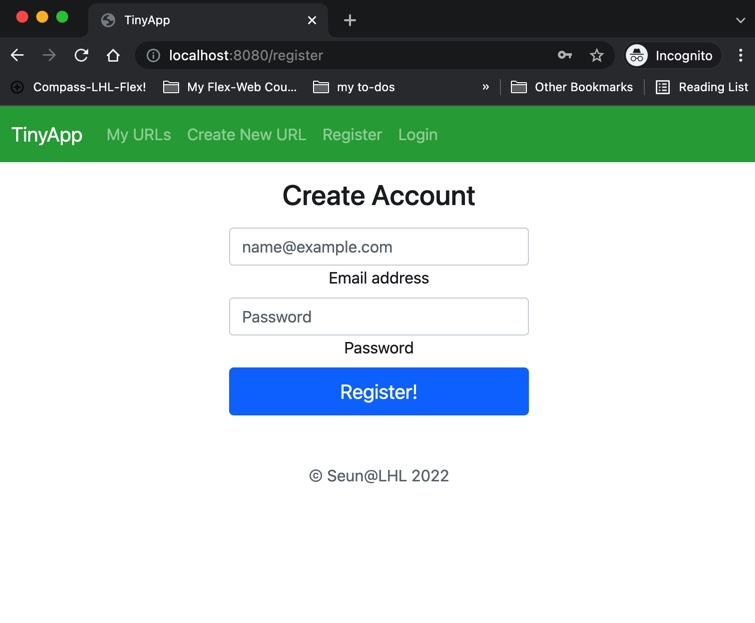
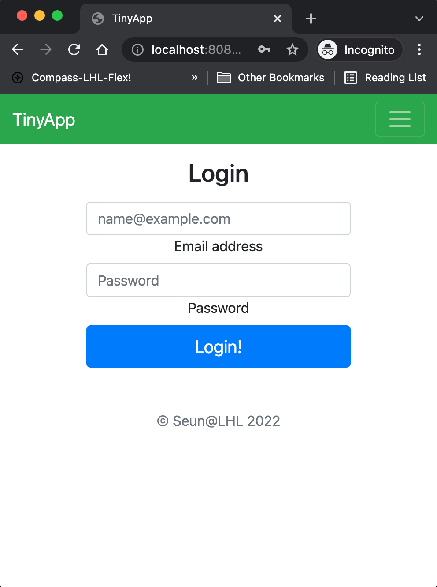
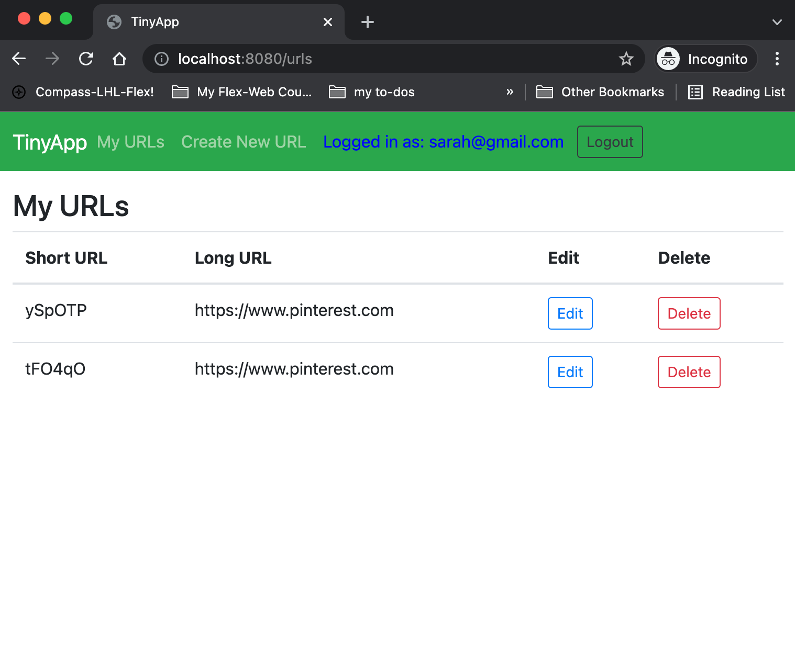
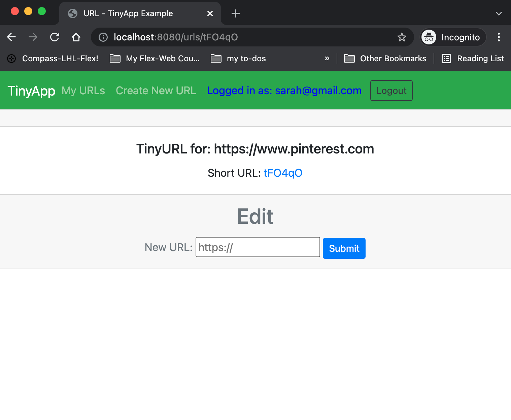

# TinyApp Project

## Author
[Seun Oshitade](https://www.linkedin.com/in/seun-oshitade-53001120b/)

## About
This project was completed by [me](https://www.linkedin.com/in/seun-oshitade-53001120b/) as part of my learnings at Lighthouse Labs. TinyApp is a full stack web application built with Node and Express that allows users to shorten long URLs (à la [bit.ly](https://bitly.com/)). In-scope outcomes include working with cookies and sessions securely (using encrypted cookies), storing passwords securely (encryption vs hashing), permissions/user-authentication best practices, use of template (embedded javascript)engines to render web pages. Other concepts covered include: Creating RESTful web server endpoints, method overriding and analytics using knowledge of cookies.

## Final Product
### `User Registration Page`

### `User Login Page`

`User-specific URL Dashboard`

`Long URL and short URL link`

## Dependencies

- Node.js
- Express
- EJS
- bcrypt
- body-parser
- cookie-session

## Getting Started

- Install all dependencies (using the `npm install` command).
- Run the development web server using the `node express_server.js` command.

## Continous Improvement
* Method override
* Analytics
* Data persistence on MongoDB
* Improve user interface/experience
* Separation of api endpoints into modules
* Further refactoring and testing of helper functions

## Acknowledgement
Credit to the community of intructors and mentors at Lighthouselabs for providing necessary guidance in the course of this project.

## License
This project is open source and available under the MIT license.